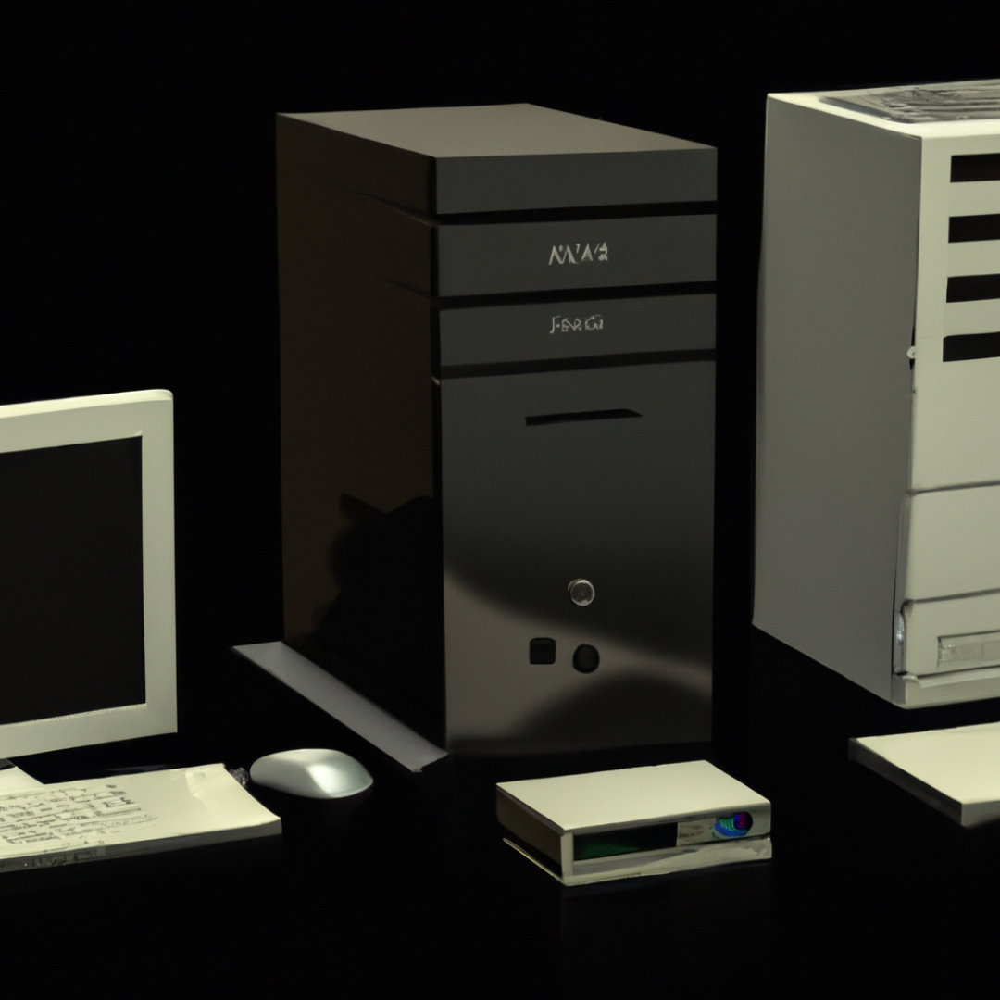
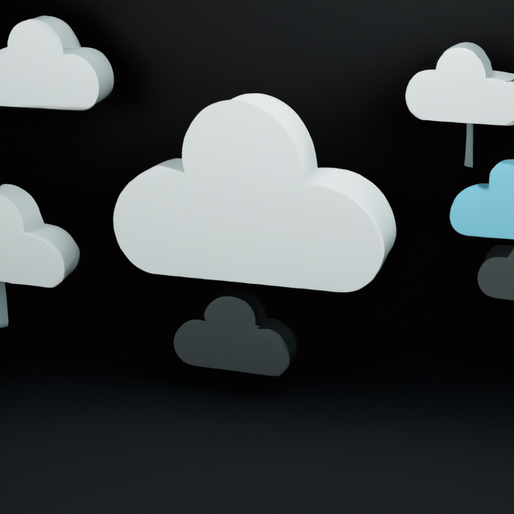
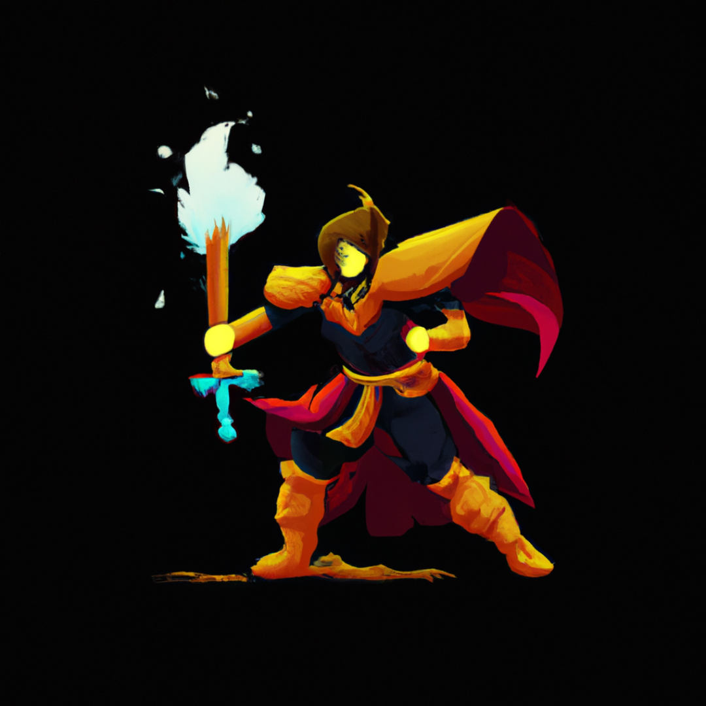
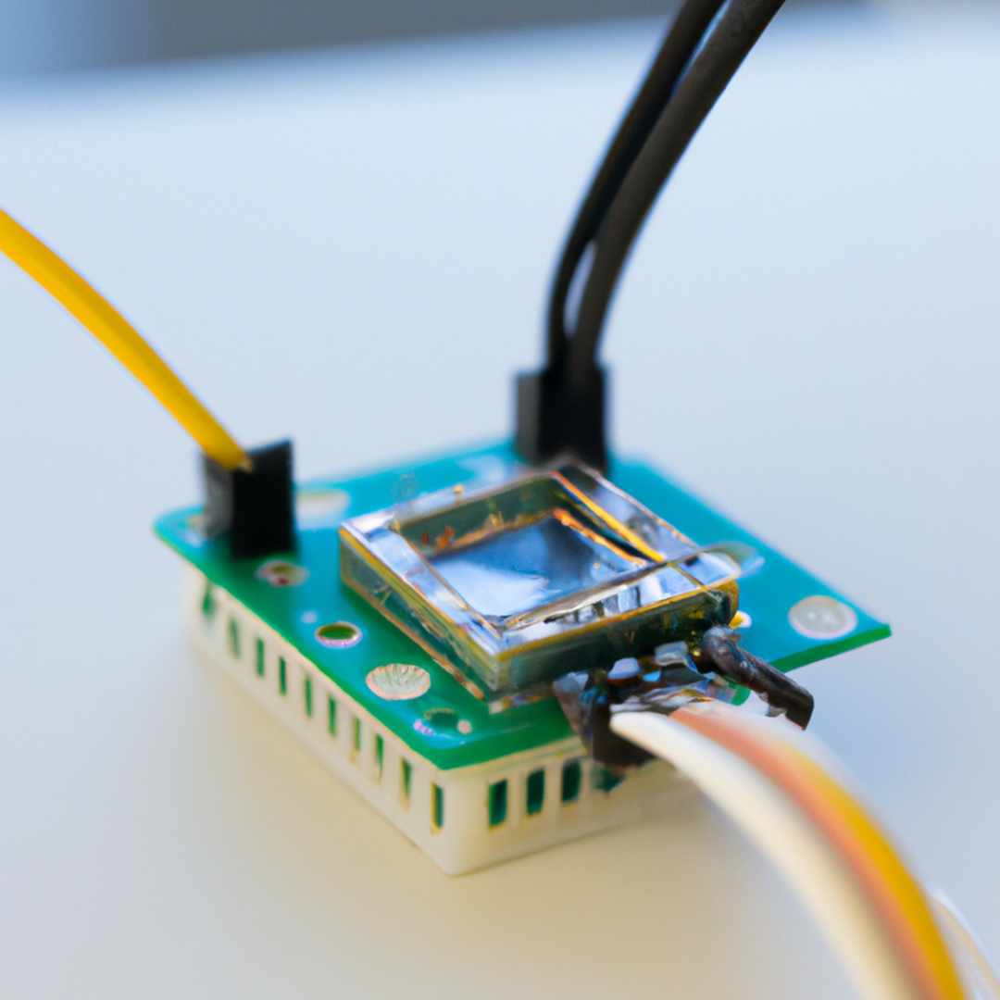
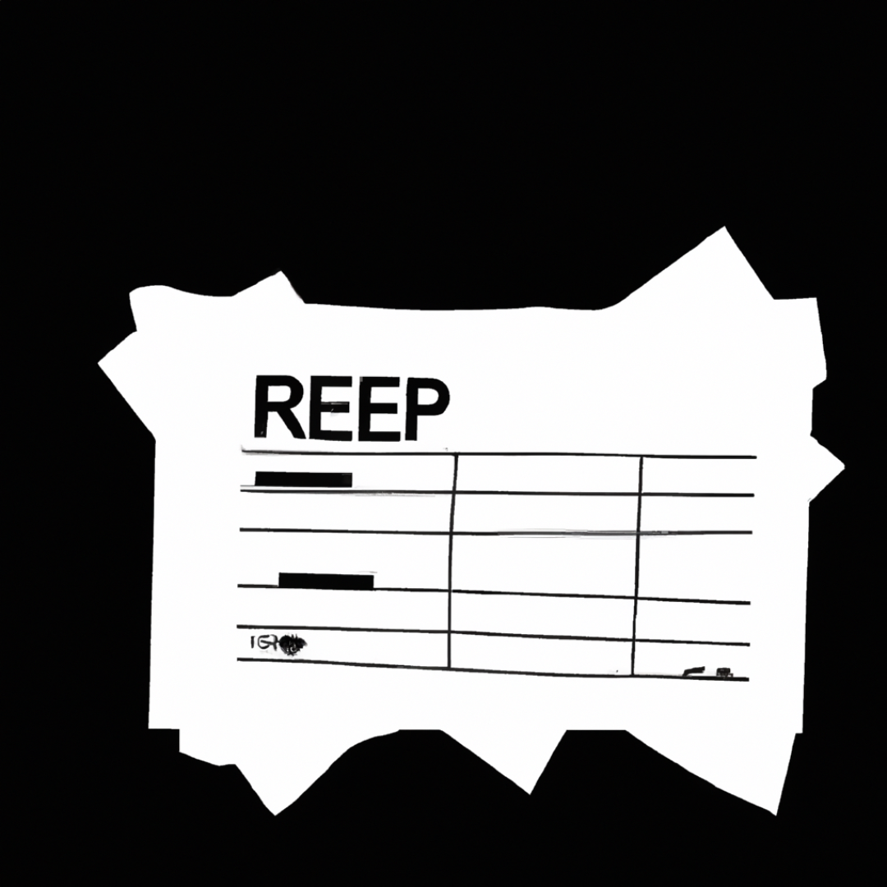

<!--
header: ''
footer: ''
paginate: false
-->

# Úvod do Microsoft Azure

<!-- Image source: https://swimburger.net/media/ppnn3pcl/azure.png -->

---

---

<!--
header: 'Úvod do Microsoft Azure'
footer: '[petrkucerak/Introduce-to-Azure-Workshop](https://github.com/petrkucerak/Introduce-to-Azure-Workshop)'
paginate: true
-->

# Idea

- learning
- aktivitka

---

# Cloud computing

> Model poskytování IT služeb a infrastruktury na vzdálených serverových zdrojích, které mohou být využívány pomocí internetu.

<!--

# Odpoved od chat GPT

Cloud Computing je model poskytování IT služeb a infrastruktury na vzdálených serverových zdrojích, které mohou být využívány pomocí internetu. Tyto služby zahrnují úložiště dat, aplikace, infrastrukturu a služby založené na časovém pronájmu, a mohou být nabízeny jako publikové, soukromé nebo hybridní cloud. Cílem tohoto modelu je umožnit uživatelům přistupovat k IT zdrojům bez nutnosti investovat do vlastní infrastruktury. 

# Cloud computing

- poskytování virtual machines, storage, databases, and networking
- krom tradicnich napr. ale i sber sluzby pro IoT, Machine Learning ci AI

-->
---

# Cloud x On-premise

<!-- 
- neni zcela presne (pod cloudem se skryva vice modelu)
- ale obecne se jedna o extremmy, pojdme si je spolecne pojmenovat
 -->

---
<!-- 
header: ''
footer: ''
paginate: false
backgroundColor: #fff
 -->

<!-- 

# Scenare poskytovani Cloud sluzeb

- pojdme zacit od konce s vysvetlenim jednotlivych bodu (zodpovednosti)

- zkuste vymyslet ke kazdemu pointu jeden priklad MSFT sluzby

SaaS (Software as a Service)
- Office
- GitHub

PaaS (Platform as a Service)
- Power Apps
- Azure Web App

IaaS (Infrastrucutre as a Service)
- Azure, napr. VM

On-prem

 -->

---

<!-- 
header: 'Úvod do Microsoft Azure'
footer: '[petrkucerak/Introduce-to-Azure-Workshop](https://github.com/petrkucerak/Introduce-to-Azure-Workshop)'
paginate: true
backgroundColor: #000

-->

# Modely cloudu

- Private cloud
- Public cloud
- Hybrid cloud
- Multi-cloud

<!-- 
- Verejny cloud - je poskytovany treti stranou, je dostupny pro vsechny v internetu
- Soukromy - je poskytovany vami, je privatni siti... Muze byt provozovan ve vasem datacentru, ci datacentru treti strany... Stoji vice penez, jste zodpovedni za veskerou udrzbu, bezpecnost atd.
- Hybrid cloud umožňuje kombinaci a největší flexibilitu
- Multi-cloud: Vice provideru cloudu (napr. goverment)

K sprave muze pomoci prave Azure Arc, nastroj od Azure

 -->
---

# Výhody cloudu

brainstorming

---

# Výhody cloudu

- škálovatelnost (horizontální x vertikální)
- pay as you go
- modely (PaaS, IaaS, ...) -> starám se o důležité věci
- bezpečnost
- ...

<!-- 
- nevýhody cloudu
  - myslím, že je dobré také se zamyslet nad touto otázkou
  - z mé zkušensoti to je pouze cena, v určité situaci
 -->
---

<!--
header: 'Úvod do Microsoft Azure | aktivitka'
footer: '[petrkucerak/Introduce-to-Azure-Workshop](https://github.com/petrkucerak/Introduce-to-Azure-Workshop)'
paginate: true
-->

# Aktivitka - scénáře

- tužka
- papír

<!-- 
# Jedná se o cloud computing a o jaký model SaaS, IaaS, PaaS

Vezměte si tužku a papír. Projedeme si několik scénářů a zajímá udělejte si poznámku u toho bodu, o kterém si myslíte, že se jedná o cloud computing a u jaké části a jaký model je aplikován?

-->

---

Scénář 1
**DYI senzor**

<!-- 

# Case 1 - DIY sensor

Jste domácí bastlíř. Stavíte si chytrou domácnost. Máte po domu nataháno několik senzorů. Ty sbírají a odesálají je pomocí Wifi do agregátoru, kterým je ve vašem případě server, který běží u vás doma na Raspberry PI. Server máte připojený do domácí lokální sítě a běží vám na něm několik služeb. Jednou z nich je i model AI, který vám pomáhá predikovat spotřebu energie v závislosti na historickém vývoji a současným ekonomickým a hospodářským trendům.

-->

---

Scénář 2
**Skener účtenek**

<!-- 

# Case 2 - skener účtenek

Studujete na vysoké škole. Pravidelně chodíte nakupovat do několika obchodních domů. Odnášite si papírové účtenky. Společně se spolubydlícími ze studentského bytu používáte aplikaci, která vám rozdělí výdaje. Nebaví vás ale neustále přepisovat, obash účtenky. Umíte programovat, tak si vyvynete vlastní webovou aplikaci, která funguje tak, že naskenuje obrázek, odešle ho do služby od Azure na rekonigici textu z účetnky. Služba vrátí strojový text popisující obash. Webová apliakce ho následně překonvertuje do formátu čitelného pro aplikci na záznam dluhů a apliakci spustí rovnou s předvyplněnými daty.

-->

---

Scénář 3
**Skener účtenek**

<!-- 

# Case 2 - skener účtenek

Studujete na vysoké škole. Pravidelně chodíte nakupovat do několika obchodních domů. Odnášite si papírové účtenky. Společně se spolubydlícími ze studentského bytu používáte aplikaci, která vám rozdělí výdaje. Nebaví vás ale neustále přepisovat, obash účtenky. Umíte programovat, tak si vyvynete vlastní webovou aplikaci, která funguje tak, že naskenuje obrázek, odešle ho do služby od Azure na rekonigici textu z účetnky. Služba vrátí strojový text popisující obash. Webová apliakce ho následně překonvertuje do formátu čitelného pro aplikci na záznam dluhů a apliakci spustí rovnou s předvyplněnými daty.

-->